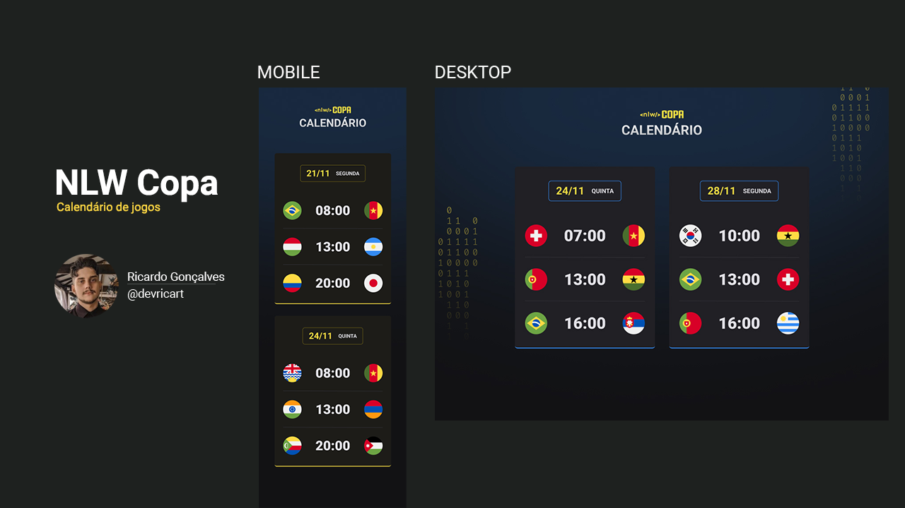

<h1 align="center"> NLW Copa </h1>

Feito no NLW 10, um evento exclusivo e gratuito, promovido pela Rocketseat para ensino de tecnologias WEB.

  <a href="#-tecnologias">Tecnologias</a>&nbsp;&nbsp;&nbsp;|&nbsp;&nbsp;&nbsp;
  <a href="#-projeto">Projeto</a>&nbsp;&nbsp;&nbsp;|&nbsp;&nbsp;&nbsp;
  <a href="#-layout">Layout</a>&nbsp;&nbsp;&nbsp;|&nbsp;&nbsp;&nbsp;
  <a href="#-layout">Contatos</a>&nbsp;&nbsp;&nbsp;|&nbsp;&nbsp;&nbsp;
  <a href="#memo-licença">Licença</a>

  

 

  

## 🚀 Tecnologias

Esse projeto foi desenvolvido com as seguintes tecnologias:

- HTML 
- CSS
- JavaScript
- Git e Github

## 💻 Projeto

O calendário da Copa é um site com responsividade que mostra uma tabela detalhada de todos os jogos que irão rolar durante a copa de 2022, com horários e dias. A maior parte do site adiciona elementos ao HTML pelo JavaScript, poupando muito tempo em repetição de adicionar elementos manualmente.

## 🔖 Layout

Você pode visualizar o layout do projeto através [DESSE LINK](https://www.figma.com/file/G6ZKTB8qlS3pNrSvZcj9yq/Calend%C3%A1rio-de-Jogos-(Community)?node-id=0%3A1&t=56vdP7DTIbvMXGve-0). É necessário ter conta no [Figma](https://figma.com) para acessá-lo.

## 📔 Contatos

E-mail: ricardo.gferreia97@hotmail.com  

## :memo: Licença

Esse projeto está sob a licença MIT.

---

Feito com ♥ by Rocketseat :wave: [Participe da nossa comunidade!](https://discord.gg/rocketseat)
